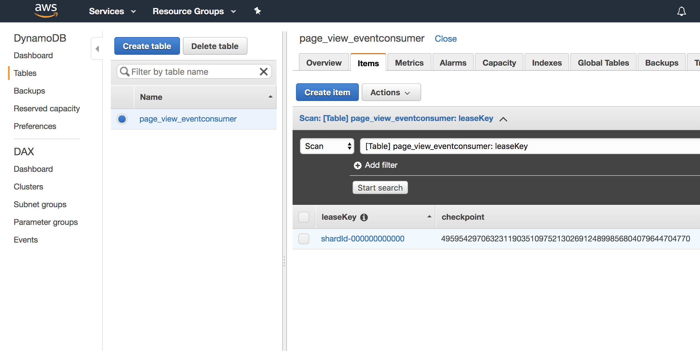

event processor example
--

logs

```json
{"@timestamp":"2019-05-05T17:48:32.580Z","source_host":"MACC02V82BPHTD7","file":"Worker.java","method":"info","level":"INFO","line_number":"1035","thread_name":"Thread-1","@version":1,"logger_name":"com.amazonaws.services.kinesis.clientlibrary.lib.worker.Worker","message":"Current stream shard assignments: shardId-000000000000","class":"com.amazonaws.services.kinesis.clientlibrary.lib.worker.Worker$WorkerLog","mdc":{}}
{"@timestamp":"2019-05-05T17:48:32.583Z","source_host":"MACC02V82BPHTD7","file":"Worker.java","method":"info","level":"INFO","line_number":"1035","thread_name":"Thread-1","@version":1,"logger_name":"com.amazonaws.services.kinesis.clientlibrary.lib.worker.Worker","message":"Sleeping ...","class":"com.amazonaws.services.kinesis.clientlibrary.lib.worker.Worker$WorkerLog","mdc":{}}
=======================
{"eventType":"PageViewedEvent","createdTime":null,"eventUuid":2,"pageId":"00e39e26-0728-4407-92c4-7f24fb70ff08","userId":"43271343-2742-4fde-91cb-04c7be364b6a","pageViewedDate":{"offset":{"totalSeconds":0,"id":"Z","rules":{"fixedOffset":true,"transitions":[],"transitionRules":[]}},"zone":{"id":"UTC","rules":{"fixedOffset":true,"transitions":[],"transitionRules":[]}},"year":2019,"monthValue":5,"dayOfMonth":4,"hour":22,"minute":53,"second":10,"nano":250479000,"month":"MAY","dayOfWeek":"SATURDAY","dayOfYear":124,"chronology":{"id":"ISO","calendarType":"iso8601"}}}
=======================
{"@timestamp":"2019-05-05T17:49:04.775Z","source_host":"MACC02V82BPHTD7","file":"SequenceNumberValidator.java","method":"validateSequenceNumber","level":"INFO","line_number":"82","thread_name":"RecordProcessor-0000","@version":1,"logger_name":"com.amazonaws.services.kinesis.clientlibrary.lib.worker.SequenceNumberValidator","message":"Validated sequence number 49595429706323119035109752130269124899856804079644704770 with shard id shardId-000000000000","class":"com.amazonaws.services.kinesis.clientlibrary.lib.worker.SequenceNumberValidator","mdc":{}}
```

consumer offset
-----------------



Also see eventstream ingestion example - https://github.com/duwamish-os/eventstream-pipeline-example1